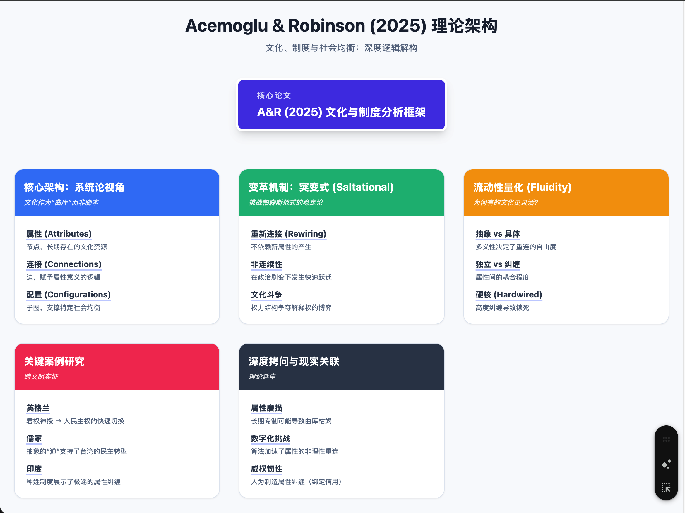

<!--more-->

# 深度述评：《文化、制度与社会均衡：一个分析框架》

**文献来源**：Acemoglu, D., & Robinson, J. A. (2025). _Culture, Institutions, and Social Equilibria: A Framework_. Journal of Economic Literature.

## 1. 架构拆解：作为系统的文化 (Architecture Decomposition)

阿西莫格鲁和罗宾逊（以下简称 A&R）在本文中并未将文化视为某种不可言喻的“空气”或僵化的“宿命”，而是将其形式化为一个动态的**系统（System）**。理解这一架构的关键在于拆解其核心组件：

### 1.1 核心模型：文化曲库 (The Cultural Repertoire)

A&R 借用了社会学家安·斯威德勒（Ann Swidler）的概念，将文化定义为一个“工具箱”或**曲库（Repertoire）**。这意味着文化不是一套强迫人们遵守的单一指令集，而是一个包含了多种可能性的资源池。

-   **属性 (Attributes)**：这是文化的微观基础，相当于图论中的“节点”。
    -   _定义_：具体的信仰、仪式、社会规范或价值观。例如：“尊卑等级”、“核心家庭”、“邻里互助”、“宗教戒律”或“祖制”。
    -   _特征_：属性本身通常是长期存在的，具有很强的历史惯性（Persistence）。
-   **连接 (Connections)**：这是赋予属性以意义的机制，相当于图论中的“边”。
    -   _逻辑_：孤立的属性往往意义模糊。例如，“等级（Hierarchy）”这个属性本身是中性的，但当它与“君权神授”连接时，它意味着绝对服从；当它与“美德（Virtue）”连接但与“血统”断开时，它可能意味着精英治国（Meritocracy）。
    -   _动态性_：连接是可以改变的。这种改变往往比属性本身的生灭要快得多。
-   **文化配置 (Cultural Configurations)**：这是社会均衡的实际产物，是特定属性通过特定连接形成的**子图（Subgraph）**。
    -   _功能_：配置为社会行为提供**意义（Social Meaning）\*\*和\*\*政治辩护（Political Justification）**。
    -   _社会均衡_：在一个特定的历史时刻，社会往往由一个主导的文化配置来支撑现行的制度安排。

### 1.2 共同决定社会均衡

在这个架构中，**社会均衡（Social Equilibrium）**是文化配置、政治制度和经济结果共同作用的产物。

-   **系统论视角**：你不能通过测量单个属性（例如问卷调查中的“信任度”或“个人主义指数”）来理解文化。必须看整个系统的**配置**。
-   **内生性**：政治权力会试图强化某些连接，抑制其他连接，从而塑造有利于自身的文化配置（例如，帝制中国的统治者强化“天命”与“等级”的连接）。

## 2. 范式转换：从渐进演化到“突变” (Paradigm Shift)

A&R 的框架是对主流文化经济学范式的一次重大挑战，甚至可以说是对“帕森斯范式（Parsonian Paradigm）”的檄文。

### 2.1 对比帕森斯范式与演化人类学

-   **传统范式（Parsons / Evolutionary Anthropology）**：
    -   _核心观点_：文化是连贯的、稳定的价值取向系统（Value-orientations）。文化代代相传，变化极其缓慢（增量式），通常通过社会化过程完成。
    -   _推论_：文化是“粘性”极强的（Sticky），是历史持续性（Persistence）的主要来源。例如，Henrich 或 Nunn 的研究强调历史遗产（如犁的使用）对数百年后性别观念的影响。
    -   _局限_：难以解释为何同一个文化圈（如朝鲜半岛或海峡两岸）在短时间内会出现制度上的剧烈分化。

### 2.2 A&R 的新范式：突变式变化 (Saltational Change)

A&R 引入了生物学中的**“跳跃进化（Saltation）”**概念，强调文化可以在极短时间内发生**不连续的（Discontinuous）、剧烈的断裂**。

-   **机制**：由于文化是“曲库”而非“脚本”，社会可以在不发明新属性的情况下，通过**重新连接（Rewiring）**现有属性，迅速从一个配置跃迁到另一个截然不同的配置。
-   **案例论证**：**17 世纪的英格兰**。
    -   _背景_：英格兰文化本身包含“等级”、“宗教”、“古代宪法（Ancient Constitution）”等属性。
    -   _旧配置_：“君权神授（Divine Right of Kings）”。将“宗教”与“父权/等级”强连接，论证国王如父亲般拥有绝对权力。
    -   _突变_：在内战和光荣革命期间，洛克（Locke）等文化创业者并未创造新文化，而是切断了“宗教”与“绝对王权”的连接，转而将“宗教”与“契约”和“邻里互助（Neighborliness）”连接，迅速形成了“人民主权（Popular Sovereignty）”的新配置。
    -   _结论_：通过重组连接，文化在短短一代人时间内从支持绝对君主制突变为支持宪政民主，而底层的文化属性库并未发生根本改变。

## 3. 流动性分析：硬核 vs 流动 (Fluidity Analysis)

为什么有的文化能迅速适应民主或市场经济，而有的却步履维艰？A&R 提出了**流动性（Fluidity）**的概念，并通过两个维度来量化。

### 3.1 抽象 vs 具体 (Abstract vs. Specific)

-   **抽象属性**：具有多义性，允许与多种其他属性连接。
    -   _案例：儒家文化_。A&R 认为儒家文化具有高度流动性，因为其核心概念（如“道”、“仁”、“礼”）高度抽象。
    -   _解释_：“道”可以解释为“顺从天命（支持帝制）”，也可以重新解释为“顺应民心（支持民主）”。这种抽象性使得台湾可以在保留儒家底色的同时，迅速转向民主体制（“儒家民主”配置）。
-   **具体属性**：意义单一，连接受限。
    -   _案例_：特定的宗教戒律若规定了具体的饮食、着装或惩罚方式，其流动性就较低。

### 3.2 嵌入/纠缠 vs 独立 (Entangled vs. Freestanding)

-   **独立属性**：可以像积木一样自由组合。
    -   _案例：英格兰文化_。虽然宗教很重要，但它与法律、商业实践相对分离（Freestanding）。这使得英格兰可以在保留宗教信仰的同时，改革政治和经济制度。
-   **纠缠属性（Entangled）**：一组属性必须共进退，牵一发而动全身。
    -   _案例：印度种姓制度_。这是**硬核文化（Hardwired Culture）\*\*的典型。种姓不仅仅是分工，它与宗教洁净观、婚姻制度、居住隔离、职业继承等属性紧密\*\*纠缠**。要改变其中一个（如职业），必须挑战整个宗教和社会等级体系。这种高纠缠度极大地限制了文化配置的重组空间，导致制度僵化。

## 4. 批判性深度思考 (Critical Deep Thinking)

作为政治经济学家，我们需要对这一框架进行更深层的拷问。

### 4.1 挑战：系统路径是否淡化了长期稳定性？

A&R 的框架极力强调“突变”的可能性，这在某种程度上是对过去二十年“历史持久性（Persistence）”文献的矫枉过正。

-   **批判**：虽然连接可以重组，但**属性的磨损**呢？如果某些属性（如“古代宪法”）在长期的专制配置下从未被激活，它们是否还能作为有效的资源存在于曲库中？
-   **思考**：A&R 假设属性是相对持久的，这可能低估了极权制度对“文化记忆”的清洗能力。在高度压迫的体制下，某些文化属性可能会被彻底从曲库中抹除，导致未来即使有机会重组，也面临“无米之炊”的困境。

### 4.2 政治与文化的互动：文化斗争 (Cultural Struggles)

本文最精彩的洞见之一是将**政治（Politics）**带回了文化分析的中心。

-   **重定义社会意义**：文化配置不是自然演化的结果，而是**文化斗争**的产物。权力结构（Elites）和挑战者（Cultural Entrepreneurs）通过争夺对属性的**解释权（Interpretation）**来进行博弈。
-   **机制**：
    -   既得利益者试图将特定配置**自然化（Naturalize）**，使其看起来像不可改变的“传统”（如清朝统治者强化儒家中的顺从面向）。
    -   变革者则试图挖掘曲库中被压抑的属性（如儒家中的“民贵君轻”），建立新的连接来挑战旧秩序。
-   **结论**：文化变革往往是政治权力转移的先导或伴随物，而非独立变量。

## 5. 现实关联：当代语境下的推演 (Real-world Implications)

基于 A&R 的框架，我们可以对当下的剧变进行推演。

### 5.1 数字化时代的“属性重连”

社交媒体算法正在充当极其高效且混乱的“连接器”。

-   **突变加速**：在数字时代，文化属性的重新连接速度呈指数级上升。例如，“身份认同”这一属性正被迅速从“民族国家”剥离，并与“亚文化部落”或“全球化价值观”建立强连接。这种快速重组可能导致社会均衡极不稳定，频繁出现“文化极化”。

### 5.2 地缘政治与“硬核化”尝试

-   **威权韧性**：某些政权正在利用技术手段尝试人为制造“纠缠（Entanglement）”。通过将“爱国主义”、“党派忠诚”、“传统文化”与“个人经济信用（如社会信用体系）”强行绑定，政权试图将原本可能流动的文化人为地“硬核化”，以减少民主化配置出现的可能性。
-   **民主的脆弱性**：反过来，西方民主国家的“自由”属性如果变得过于抽象且脱嵌（Freestanding），失去与“责任”、“社群”等属性的连接，也可能导致社会原子化，从而诱发民粹主义的某种回归——即一种寻求确定性和强连接的文化反弹。

**总结**： Acemoglu 和 Robinson 并没有否定文化的作用，而是将其从“命运”降格为“工具”。对于改革者而言，这是一个充满希望的框架：**你不需要等到旧文化彻底消亡，你只需要找到那个解开死结的线头，重新编织意义之网。**
