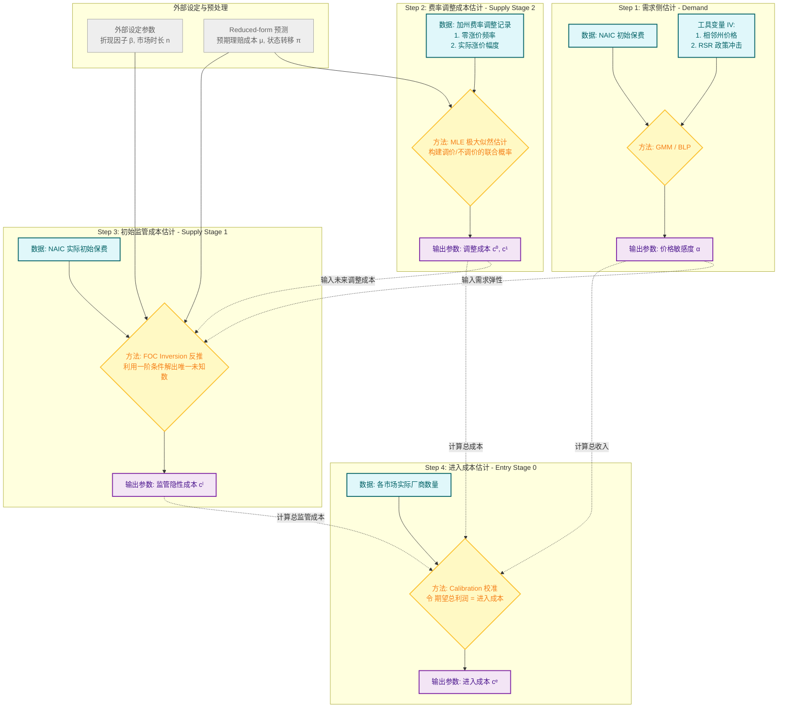
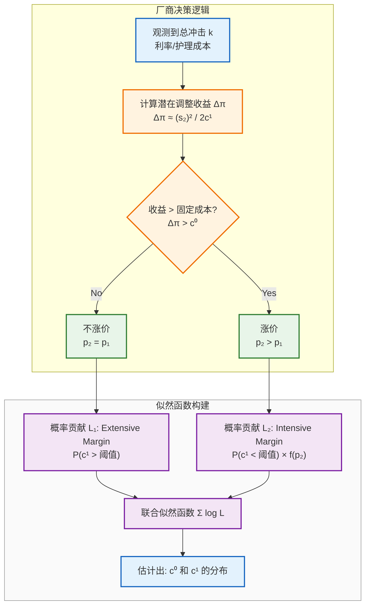

Journal of Political Economy

<!--more-->

## 1. 经济学直觉 (Economic Intuition)

这篇文章探讨了长期护理保险（LTCI）市场中的一个核心摩擦：**保险公司的承诺能力有限（Lack of Commitment）与逆向选择/锁定效应之间的矛盾**。

-   **核心权衡**：
-   保险公司面临总成本冲击（Aggregate Shocks，如利率风险、护理成本上升）。
-   为了防止保险公司在消费者被“锁定”（Locked-in，因年龄增长无法转换保险）后利用市场势力通过涨价剥削消费者，监管机构实施了**动态定价监管（Dynamic Pricing Regulation）**，限制保费随时间调整的能力 。

-   **Trade-off**：严格的监管虽然平滑了消费者的保费波动（利好），但也增加了保险公司的财务摩擦，导致其利润下降、退出市场，从而减少了产品多样性并增加了市场集中度（利空）。

## 2. 理论模型 (Theoretical Model)

文章建立了一个非完全竞争（Imperfect Competition）、保险公司无法完全承诺（Limited Commitment）的动态均衡模型。

A. 时间轴 (Timeline) 模型分为三个阶段：

1. **Stage 0 (Entry)**: 边缘厂商（Fringe firms）决定是否支付固定成本 进入市场。
2. **Stage 1 (Initial Pricing)**: 厂商 设定初始保费 。消费者根据效用最大化选择购买保险或保留外部选项（Medicaid 等）。
3. **Stage 2 (Repricing & Claims)**:

-   总冲击 （利率 , 护理价格 , 其他冲击 ）实现。
-   厂商观察到冲击后，决定是否调整保费至 。
-   消费者决定是否退保（Lapse）。
-   风险发生，进行理赔。

**B. 厂商的动态优化 (Firm's Dynamic Optimization)**

这是一个典型的逆向归纳求解问题。

-   **Stage 2 (Repricing)**: 给定状态 和初始市场份额 ，厂商选择 最大化第二期利润。

-   : 预期的理赔成本。
-   : **费率调整成本函数 (Rate Adjustment Cost Function)**。这是模型的关键结构，捕捉了监管摩擦和声誉成本 。

-   **Stage 1 (Initial Pricing)**: 厂商预判第二期的最优反应，选择 最大化跨期总利润：

-   : 初始定价监管成本（针对 Loss Ratio 的监管）。

    **C. 消费者的效用函数 (Consumer Utility)**

模型考虑了消费者异质性 （收入、家庭护理可得性、**信念**）。

-   **信念异质性 (Belief Heterogeneity)**: 这是一个重要的设定。
-   **Rational Consumers**: 能够正确预期第二期保费 。
-   **Myopic/Misinformed Consumers**: 错误地认为保费将保持不变 () 。

-   **期望效用**:

-   : 品牌固定效应/不可观测质量。
-   利用 Logit 形式得出市场份额 。

## 3. 结构方程估计 (Structural Estimation)

这是你最关心的部分，文章采用了分步估计策略（Step-wise Estimation）。

如果你是小白，请直接看最后一节，『小白也能看懂』。

Step 1: 需求侧估计 (Demand Side Estimation)

-   **方法**: 类似于 Berry, Levinsohn, and Pakes (1995) 的 BLP 框架，通过 GMM 估计。
-   **核心方程**: 市场份额方程（Logit 形式）。
-   **识别策略 (Identification Strategy)** - 处理价格 的内生性：

1.  **Instrument 1 (Hausman-style)**: 使用同一保险公司在**相邻州**的初始保费作为工具变量。逻辑是供给侧的成本冲击（Cost shocks）在地理上相关，但需求侧冲击不相关 。

2.  **Instrument 2 (Policy Shocks)**: 利用各州采纳 **RSR 2000 (Rate Stability Regulation)** 的时间差异。这一政策外生改变了费率调整的预期，从而影响理性消费者的需求 。

-   **参数**: 估计出价格敏感度 和品牌特征 。

Step 2: 供给侧估计 (Supply Side Estimation)

这一步恢复成本函数参数，这是进行反事实分析的基础。

1. 费率调整成本 (Rate Adjustment Cost) :

-   **设定**:

包含固定成本 和凸调整成本 。

-   **估计方法**: **极大似然估计 (Maximum Likelihood Estimator, MLE)**。
-   **逻辑**: 利用第二期利润最大化的 FOC。如果观测到调价，则 FOC 成立；如果未调价，则说明调整收益小于固定成本。构建似然函数进行估计 。

-   **识别变异**: 利用费率调整数据（Rate increase data）中，不同总冲击（利率、护理成本）下调价幅度的差异来识别 。

2. 初始定价监管成本:

-   **估计方法**: 利用第一期的一阶条件 (FOC) 直接反推（Back out）。
-   **逻辑**: 已知需求弹性（Step 1）和未来调整策略（Step 2.1），厂商定价的 FOC 中唯一的未知数就是边际监管成本。

3. 进入成本 (Entry Cost):

-   基于均衡时的零利润条件（针对边缘厂商）推导进入门槛 。

## 4. 主要结论与反事实分析 (Results & Counterfactuals)

基于估计出的结构模型，作者进行了政策模拟：

1. **动态定价监管的效果**：

-   更严格的监管确实减少了保费波动（Premium volatility）。
-   **但是**，它导致了保险公司利润显著下降，进而导致**边缘厂商退出市场**（Fringe firms exit），市场集中度上升，产品多样性下降 。

2. **福利分析**：

-   消费者福利的净增加非常有限（几乎为 0，仅 0.05%）。原因是：更加稳定的保费带来的效用收益，被产品种类减少和市场势力增加（导致初始定价上升）带来的效用损失相互抵消了 。

3. **Medicaid 的交互作用**：

-   如果公共保险（Medicaid）更慷慨，会挤出私人保险需求，但这反而使得动态定价监管的负面供给侧效应（厂商退出）变小。这意味着在强公共保障环境下，监管成本更低 。

---

## 结构参数估计总结

这篇文章的结构估计过程（Structural Estimation Process）设计得非常精妙，它采用了**分步估计（Multi-step Estimation）**的策略。

这种策略避免了在一个巨大的嵌套循环中同时估计所有参数（计算负担过重），而是利用模型的递归结构，先估计需求，再反推供给成本。

以下是针对你作为经济学博士生的专业视角，对该过程的深度拆解：

---

### 第一步：需求侧估计 (Demand Estimation)

详见 [需求结构估计](/posts/Demand/)。

**目标**：恢复消费者效用函数中的参数，特别是价格敏感度和品牌固定效应。

1. **模型设定**：文章使用了类似于 Berry, Levinsohn, and Pakes (1995) 的 **BLP 随机系数 Logit 模型**的简化版。

-   消费者的期望效用取决于收入、保费、品牌特征以及对未来费率调整的信念（理性 vs. 短视）。

-   不可观测的质量冲击设定为： 。

2. **内生性问题 (Endogeneity)**：

-   初始保费 与不可观测的需求冲击 相关（例如，保险公司观察到某地需求高涨，可能会提高定价）。

3. **识别策略 (Identification / IVs)**：作者使用了两组工具变量（Instruments）来解决内生性：

-   **Hausman-style IV**：利用同一保险公司在**相邻州**的初始保费。逻辑是：供给侧的成本冲击（如总部运营成本）在地理上相关，但特定州的需求冲击不相关 。

-   **Policy IV (RSR 2000)**：利用各州采纳 **RSR 2000 监管政策**的时间差异。逻辑是：这一政策外生改变了费率调整的预期（供给侧约束），会影响理性消费者的需求，但与未观测到的当期需求冲击不相关 。

4. **估计算法**：

-   使用收缩映射（Contraction Mapping）反推平均效用 ，使模型预测的市场份额等于实际市场份额。
-   构建矩条件（Moment Conditions）：，通过 **GMM** 进行估计 。

---

### 第二步：供给侧估计 (Supply Estimation)

这是文章的核心创新点。由于模型是动态博弈，作者采用了**逆向归纳（Backward Induction）**的逻辑，但估计顺序是**从底层参数向上层反推**。

#### 子步骤 2.0：外生过程估计 (Outside the Model)

在进入结构模型前，作者先在模型外估计了状态转移和理赔分布：

-   **总冲击过程**：利用数据估计利率 ()、护理价格 () 和其他冲击 () 的分布 。

-   **理赔成本 ()**：根据消费者类型权重和总冲击，预测第二期的预期理赔成本 。

#### 子步骤 2.1：第二阶段费率调整成本 (MLE)

**目标**：估计费率调整成本函数 中的固定成本 和可变成本系数 。

1. **逻辑基础**：在第二阶段，厂商观察到冲击 后，选择新的保费 以最大化第二期利润。一阶条件（FOC）意味着边际收益等于边际调整成本。
2. **似然函数构建 (Likelihood Function)**：这是一个混合了离散选择（调价/不调价）和连续变量（调价幅度）的问题。

-   **情形 A（调价 ）**：说明调整带来的利润增加超过了固定成本 ，且调价幅度满足 FOC： 。这提供了关于 分布的信息。

-   **情形 B（不调价 ）**：说明调整带来的潜在利润增加小于固定成本 。这提供了关于 的信息。

3. **估计算法**：假设 服从对数正态分布。作者构建了联合似然函数，使用 **最大似然估计 (MLE)** 估计出 。

> **博士生笔记**：注意这里，作者没有仅仅回归调价幅度，而是显式建模了“不调价”的概率。这对于捕捉菜单成本（Menu Cost）式的摩擦至关重要。

#### 子步骤 2.2：第一阶段初始定价监管成本 (Inversion)

**目标**：恢复初始定价监管成本参数 。

1. **逻辑基础**：回到第一阶段，厂商选择初始保费 最大化跨期总利润（包含预期的第二期利润）。
2. **反推法 (Backing-out)**：利用第一阶段的一阶条件 (FOC) 。

-   此时，需求参数（来自第一步）、第二期调整策略和成本（来自子步骤 2.1）都已知。
-   FOC 中唯一的未知项就是初始监管成本的边际项 。
-   作者直接解出这个参数，使模型完全拟合观测到的初始保费。

#### 子步骤 2.3：进入成本 (Calibration)

**目标**：估计边缘厂商的进入成本 。

1. **逻辑基础**：边缘厂商进入直到预期利润等于进入成本： 。

2. **估计算法**：假设进入成本服从对数正态分布。校准分布的参数，使得模型预测的进入厂商数量与数据中观察到的数量（）相匹配 。

---

## 小白也能看懂

作为博士生，你不仅需要知道“大概做了什么”，更需要知道参数是如何与数据一一对应的。

### 一、 参数清单：我们需要估计什么？

在结构模型中，参数分为两类：**外部校准/设定参数（Calibrated/Assumed）** 和 **结构估计参数（Structurally Estimated）**。

#### 1. 外部校准/设定参数 (无需估计，直接拿来用)

这些参数通常难以通过现有的市场数据识别，或者不是文章关注的焦点，因此参考前人文献或直接从数据统计中获得。

| 参数符号 | 经济学含义 | 来源 / 数据 |
| --- | --- | --- |
| $\beta$ | 折现因子 | 设定为 0.97 (标准文献值) |
| $n_1, n_2$ | 第一/二阶段时长 | 设定为 8 年 / 4 年 (基于行业平均) |
| $\mu_{jk}$ | **预期理赔成本** | **Reduced-form 预测**：利用 HRS 数据和 NAIC 索赔数据，在模型外先回归出来 |
| $\delta_k$ | 退保率 (Lapse rate) | 设定为 3% (基于行业报告) |
| $u(\cdot)$ | 风险厌恶系数 | 设定为 Log Utility (CRRA $\gamma=1$) |

#### 2. 结构估计参数 (这是核心，也是我们要解的未知数)

这些是模型的结构 Primitives，是反事实分析的基础。

| 参数符号 | 经济学含义 | 估计方法 | 识别数据来源 (Variation) |
| --- | --- | --- | --- |
| $\alpha$ | **价格敏感度** (需求弹性) | **GMM (BLP)** | NAIC 初始保费数据 (利用地理/政策 IV 识别) |
| $c^0$ | **费率调整固定成本** (Menu Cost) | **MLE** | 加州数据：**“零涨价”的频率** (Extensive margin) |
| $c_{jk}^1$ | **费率调整可变成本系数** (凸成本) | **MLE** | 加州数据：**实际涨价的幅度** (Intensive margin) |
| $c_j^l$ | **初始定价监管成本** (Shadow Cost) | **FOC 反推** | NAIC 初始保费数据：**实际价格与无监管最优价格的价差** |
| $c^e$ | **市场进入成本** | **校准 (Calibration)** | NAIC 数据：**各市场的公司数量** |

### 二、 深度解析：结构估计的具体过程与逻辑

为什么必须用结构估计？因为这些**成本参数（Costs）是不可观测的（Latent）**。我们只能看到厂商的**决策结果（价格、进出）**。我们需要建立一个模型，假设厂商是理性的，然后问：**“到底是什么样的成本结构，导致了厂商做出了我们观察到的这些决策？”**

详见 [需求结构估计](/posts/Demand/)。

#### 第一步：需求估计 (GMM)

-   **为什么要估？** 不知道消费者对价格多敏感 ($\alpha$)，就无法算出厂商的边际收益 (Marginal Revenue)，后续的利润最大化方程就写不出来。
-   **方法选择：GMM (BLP-style)**
    -   **为什么选它？** 因为价格 $p_{j1}$ 是内生的（Endogenous）。价格高可能是因为不可观测的质量好 ($\xi_j$ 高)。普通的 OLS 回归会导致 $\alpha$ 估计偏误。
    -   **矩条件 (Moment Condition)**：$E[\Delta \xi_{jt} \cdot Z_{jt}] = 0$。即工具变量 $Z$ 与需求冲击无关。所以你可以看出为什么要找工具变量，功利的说，==就是为了凑这个矩条件==。
    -   **怎么找 IV**：过往文献的惯用做法永远是第一选择，如果不行的话就硬找，但你很难去夯实地论证你的 IV 的外生性有多严格。
    -   **数据逻辑**：利用**相邻州的同公司价格**作为 IV。若相邻州价格高（供给侧成本冲击），本州价格也高，但本州需求冲击与邻州无关。这样就识别出了纯粹的价格弹性。

#### 第二步：费率调整成本估计 (MLE) —— 全文最难点

这一步是结构估计中最具技术含量的部分，因为它处理了一个**角点解**问题：大量观测值是“零涨价”。

-   **为什么要估？** 因为你全文最大的亮点是你的**福利分析/反事实估计**，离不开这俩参数，这是衡量“动态定价监管”强度的核心参数。如果在反事实中改变监管，变的就是这个 $c^0$ 和 $c^1$。

-   **参数设定与分布**： 成本函数设定为：

    $$C(p_1, p_2) = \mathbb{1}(p_2 \neq p_1) \left[ c^0 + \frac{c_{jk}^1}{2}(p_2 - p_1)^2 \right]$$

    其中，作者假设**可变成本系数** $c_{jk}^1$ 在厂商间是异质的，服从**对数正态分布** $c_{jk}^1 \sim \ln N(\mu_c, \sigma_c)$。别问为什么，大家都这么假设，技术上方便处理呗。

-   **厂商的决策逻辑**： 厂商只有在**调整带来的利润增量 (**$\Delta \Pi$**) 超过固定成本 (**$c^0$**)** 时，才会选择涨价。

    $$\Delta \Pi \approx \frac{(s_{jk2})^2}{2 c_{jk}^1} > c^0 \implies c_{jk}^1 < \frac{(s_{jk2})^2}{2 c^0}$$

    _(注：这意味着如果_ $c^1$ _越小，即调整的可变成本越低，厂商越容易克服固定成本_ $c^0$ _进行调价)_
    - 有了这个关系，我们就可以据此来构造似然函数了。

-   **似然函数构建**： 由于 $c_{jk}^1$ 是未被观测到的随机变量，我们需要根据观测到的价格行为推断它的分布参数 $(\mu_c, \sigma_c)$ 以及固定成本 $c^0$。我们总可以在数据中观察到厂商动了或没动时候的情况，所以似然函数由两部分组成：

    1. **不涨价样本 (**$p_{jk2} = p_{j1}$**)** —— **Extensive Margin**

        - **含义**：观测到厂商没动，说明它的 $c_{jk}^1$ **太大**了，导致调整利润无法覆盖 $c^0$。

        - **概率贡献**：

            $$Pr(\text{No Change}) = Pr\left( c_{jk}^1 > \frac{(s_{jk2})^2}{2 c^0} \right) = 1 - F\left( \frac{(s_{jk2})^2}{2 c^0} \right)$$

            其中 $F(\cdot)$ 是对数正态分布的 CDF。

    2. **涨价样本 (**$p_{jk2} > p_{j1}$**)** —— **Intensive Margin**

        - **含义**：观测到厂商动了，说明 (1) 它的 $c_{jk}^1$ 足够小（迈过了门槛）；(2) 它的具体涨价幅度满足一阶条件 FOC：$c_{jk}^1(p_{jk2} - p_{j1}) = s_{jk2}$。

        - **概率贡献**：

            $$Likelihood = \underbrace{F\left( \frac{(s_{jk2})^2}{2 c^0} \right)}_{\text{迈过门槛的概率}} \times \underbrace{f\left( \frac{s_{jk2}}{p_{jk2} - p_{j1}} \right)}_{\text{FOC 隐含的具体取值密度}}$$

-   **总结**：通过最大化上述两部分构成的联合似然函数，我们可以同时识别出 $c^0$（主要由有多少人不涨价决定）和 $c^1$ 的分布（主要由涨价的人涨了多少决定）。

#### 第三步：初始定价监管成本估计 (Inversion / Backing-out)

-   **为什么要估？** 我们观察到初始价格 $p_{j1}$ 很低，但计算出的需求弹性不大（厂商本该定高价）。这中间的“价差”就是因为监管限制（Loss Ratio Requirement）导致的隐性成本 $c_j^l$。

-   **方法选择：一阶条件反推 (FOC Inversion)**

    -   **原理**：对于理性厂商，观测到的价格 $p_{j1}$ 一定是其最优解。因此，$p_{j1}$ 必须满足一阶导数为 0。

    -   **公式逻辑**：

        $$\frac{\partial \pi_{未来的}}{\partial p_{j1}} + \frac{\partial \pi_{现在的}}{\partial p_{j1}} - \text{监管边际成本}(c_j^l) = 0$$

        这个方程里，前两项算得出来（基于 Step 1 和 Step 2 的结果），$p_{j1}$ 是数据里有的。**唯一的未知数就是** $c_j^l$。

    -   **操作**：不需要复杂的优化算法，直接移项求解，算出每个公司的 $c_j^l$。

#### 第四步：进入成本估计 (Calibration)

-   **为什么要估？** 为了分析福利。如果监管太严，厂商会退出。我们需要知道厂商的“底线”（进入成本 $c^e$）是多少，才能预测有多少厂商会因为利润下降而跑路。

-   **方法选择：校准 (Calibration)**

    -   **原理**：零利润条件，边缘厂商会一直进入市场，直到**期望总利润 = 进入成本**。

    -   **操作**：

        1. 算出当前市场环境下，一家典型边缘厂商能赚多少钱（这是基于 Step 1-3 算出的 Expected Profit）。

        2. 直接令 $c^e$ 等于这个金额。

        3. 调整分布参数，使得模型模拟出的厂商数量 $N_{model}$ 等于数据中的厂商数量 $N_{data}$。

### 三、 总结：为什么这么做？

你可能会问：**“为什么不直接回归一下：监管变严 -> 价格变多少？”**（这是 Reduced-form 的做法）。

**因为 Lucas 批判（Lucas Critique）。** 如果政策变了（例如 RSR 2000 实施），厂商的**定价策略函数**本身会发生改变。

-   **Reduced-form** 只能看到历史规律，政策一变，历史规律失效。
-   **Structural Estimation** 估计的是**“成本参数”**（比如调整一次价格要花多少钱）。这些参数是**深层的、不变的（Deep Parameters）**。
-   **反事实逻辑**：我们可以手动修改这些深层参数（比如把 $c^0$ 增加 50%），然后把这些参数代回模型，重新求解厂商的最优定价和进入决策。这就是这篇论文能做“福利分析”的根本原因。

## 结构估计流程可视化

后一步的估计往往需要前一步估计出的参数作为输入，这正是结构模型估计内部逻辑一致性的体现。

### 重点 + 难点：费率调整成本的 MLE 估计逻辑

这一步处理的是结构估计中最棘手的**角点解（Corner Solution）问题。厂商的决策是一个两阶段过程：先决定是否调整**（Extensive Margin），再决定**调整多少**（Intensive Margin）。

下面的流程图展示了似然函数是如何由这两部分构成的：

